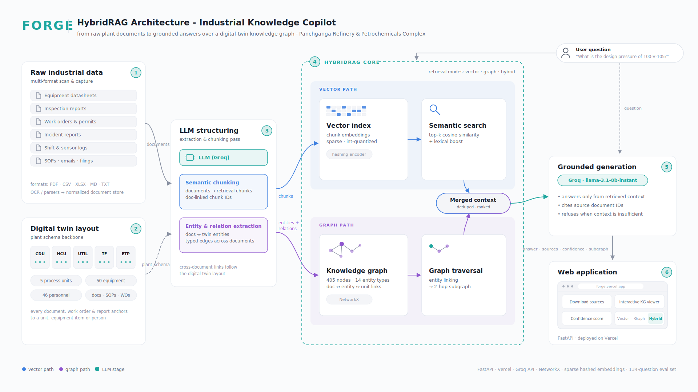

# FORGE — Industrial Knowledge Copilot

**Problem Statement 8 · AI for Industrial Knowledge Intelligence: Unified Asset & Operations Brain**

> Ask a plant anything. FORGE turns a refinery's scattered paperwork into a queryable
> **industrial digital twin** — and answers questions over it with a **HybridRAG** engine that
> cites its sources, shows its confidence, and draws you the exact slice of the knowledge
> graph it reasoned over.

---

## The problem, in one sentence

An average large Indian plant runs on **7–12 disconnected document systems**; engineers spend
**~35% of their time** hunting for information that already exists, and **25% of experienced
operators will retire within a decade**, taking undocumented knowledge with them. The
information isn't missing — it's *fragmented*, and no single system knows how a work order, an
incident report, an SOP, and a regulatory filing relate to the same pump.

## Our core idea: don't index documents — reconstruct the plant

Most RAG demos treat documents as a bag of text to embed. FORGE's bet is different: **the
plant itself is the schema.** Every document in an industrial facility is *about* something
physical — a vessel, a process unit, a person, a parameter. So before any retrieval happens,
we rebuild that physical reality as an **industrial data twin**: the *Panchganga Refinery &
Petrochemicals Complex* (PRPC), a fully synthetic but internally consistent refinery with
**5 process units, 50 tagged equipment items, and 46 personnel**, and a 12-category document
corpus that mirrors what a real plant actually accumulates — equipment datasheets, P&ID
references, maintenance work orders, inspection reports, incident reports, SOPs, safety
procedures, shift logs, sensor logs, email archives, master registers, and regulatory
submissions.

Because every document anchors to the twin, fragmentation becomes *solvable*: the pump
`100-P-101A` in a 2024 work order, a 2025 inspection report, and a vendor email are provably
the **same node**, not three coincidental strings.

## LLM-built knowledge graph + semantic chunks = documents that classify themselves

An LLM structuring pass (see stage **3** in the architecture diagram) reads the raw corpus and
produces two synchronized representations of the same knowledge:

1. **Entity & relation extraction → knowledge graph.** The LLM pulls out equipment tags,
   personnel, process parameters, dates, and regulatory references, and emits *typed* nodes
   and edges. The result is a **405-node, 781-edge** graph spanning **14 entity types**
   (Equipment, WorkOrder, Incident, SOP, RegulatorySubmission, …) connected by **20+ typed
   relations** (`PERFORMED_ON`, `GOVERNED_BY`, `INSPECTED_BY`, `REFERENCES`, `SUPPLIED_BY`,
   …). Crucially, this is what gives us **proper document classification**: a document isn't
   filed into a folder — it's *placed into the graph*, typed by what it is and linked to what
   it's about. Classification stops being a label and becomes a set of relationships.
2. **Semantic chunking → retrieval chunks.** The same pass splits every document into
   **667 meaning-preserving chunks**, each carrying a document-linked chunk ID — so any chunk
   retrieved later can be traced back to its exact source document, and from there into the
   graph.

New records slot into the same pipeline: extract entities, link to existing twin nodes, chunk,
embed. The graph *grows* with the plant instead of going stale — which is exactly the
"updates automatically as new records arrive" behavior the challenge asks for, and the only
credible answer to the retiring-workforce knowledge cliff: knowledge captured as structure,
not tribal memory.

## HybridRAG: two retrievers that cover each other's blind spots

FORGE runs three switchable retrieval strategies over the same corpus — **Vector**, **Graph**,
and **Hybrid** — because neither classic RAG paradigm is sufficient alone:

| | **VectorRAG** (semantic search over chunks) | **GraphRAG** (entity linking + subgraph traversal) |
|---|---|---|
| **Great at** | Fuzzy, descriptive questions: *"what does the debutanizer overhead procedure say about relief pressure?"* | Multi-hop, relational questions: *"which technician worked on equipment supplied by Vendor X that later had an incident?"* |
| **Blind spot** | Can't chain facts across documents; retrieves *similar text*, not *related things*; can't see what's **missing** | Can't handle paraphrases or questions about content the extractor didn't model as an entity |
| **Mechanism** | top-k cosine similarity + lexical boost over 667 chunk embeddings | link question entities into the KG → expand a 2-hop subgraph → serialize facts |

**Hybrid mode runs both paths in parallel and merges the results — deduplicated and ranked —
into a single context window.** The two are genuinely complementary rather than redundant:
vector retrieval supplies the *verbatim evidence* (the paragraph with the actual design
pressure), while graph retrieval supplies the *connective tissue* (that this vessel sits in
the CDU, was inspected in March, and is governed by SOP-100-002). The LLM gets both the quote
and the context around it — which is what lets it answer cross-functional questions that span
maintenance, safety, and regulatory records that would normally live in separate systems. The
hardest class of industrial question — *compliance-gap detection*, e.g. "which reportable
incidents have **no** regulatory submission?" — is only answerable at all via the graph,
because it requires reasoning about the *absence* of an edge, something no similarity search
can retrieve.

Generation is strictly grounded: the LLM (Groq, `llama-3.1-8b-instant`) answers **only** from
retrieved context, cites source document IDs, and is instructed to refuse rather than
hallucinate when the context doesn't contain the answer.

## Trust is a feature: citations, confidence, and a glass-box graph

Industrial users won't act on an answer they can't audit — so FORGE makes every answer
inspectable:

- **Sources panel** — every retrieved chunk and entity, tagged by *which retrieval path*
  surfaced it, with links to the original documents (downloadable).
- **Confidence score** — a 0–100 heuristic computed from retrieval signals (vector similarity
  strength, graph linkage richness, refusal check), honestly labeled as a heuristic, and free:
  no extra LLM call.
- **Interactive KG viewer** — renders *only* the subgraph actually used for the current
  answer (not the full 405-node graph): zoom, pan, click any node or edge to inspect its
  properties. You can literally *see* what the system reasoned over.

## We measure it: a 134-question ablation benchmark

We didn't just build HybridRAG — we built the instrument to prove it's better. A
**134-question evaluation set** with programmatically computed ground truth (no hand-guessed
answers) spans 7 categories: entity extraction, single-hop factual, multi-hop relational,
temporal reasoning, compliance-gap detection, cross-functional discovery, and **8 deliberately
unanswerable questions** to score hallucination resistance. Each question is labeled with its
hypothesized ideal strategy (vector / graph / hybrid), enabling a head-to-head
VectorRAG-vs-GraphRAG-vs-HybridRAG ablation, plus a `naive_keyword_hit_count` per question
that quantifies time-to-answer versus traditional keyword search across "7–12 systems."

## Architecture

*(Dark-mode version: [docs/architecture_dark.svg](docs/architecture_dark.svg).)* Follow the
numbered stages: **(1)** heterogeneous raw plant documents → **(2)** the digital-twin plant
schema they anchor to → **(3)** the LLM structuring pass producing chunks + graph →
**(4)** the HybridRAG core with its blue vector path and purple graph path merging into one
context → **(5)** grounded, cited, refusal-capable generation → **(6)** the web app with
sources, confidence, and the interactive KG viewer.

## Engineering choices worth judging us on

- **Serverless-first, zero-ops:** FastAPI on Vercel. No database server, no build step,
  vanilla-JS frontend with no external libraries. Cold start to answer in seconds.
- **A deliberate tradeoff — no vector DB:** at 667 chunks, a full vector database is
  overhead, and shipping a 150–250 MB embedding runtime risks blowing serverless size limits.
  Instead: sparse, integer-quantized hashed embeddings in a ~2.6 MB JSON file, searched
  in-memory with numpy in milliseconds, backed by a lexical fast path for exact equipment-tag
  and document-ID queries. We document what this costs (weaker paraphrase matching in pure
  Vector mode) — and note that Graph mode is entirely unaffected, another way the hybrid
  design hedges risk. Swapping in a real embedding model is a one-file change
  (`app/embeddings.py`).
- **Mobile-first for the field:** the challenge asks for a copilot that works for field
  technicians, not just desktop engineers — the UI is fully responsive from phone to
  wide-screen, with no login friction.
- **Honest data:** everything is synthetic and generated for this project; no real plant,
  people, or incidents. That's what makes exact-match evaluation possible.

## Tech stack

**FastAPI · Groq API (LLM) · NetworkX (graph) · numpy (vector search) · vanilla HTML/CSS/JS ·
Vercel serverless**

---

*Repository guide: [README.md](README.md) for architecture details and setup,
[app/data/eval/test_dataset_readme.md](app/data/eval/test_dataset_readme.md) for the
evaluation methodology.*
